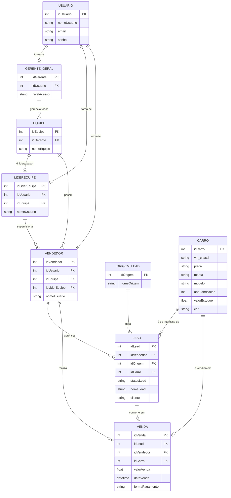

```mermaid
erDiagram
    USUARIO ||--o| GERENTE_GERAL : "torna-se"
    USUARIO ||--o| LIDEREQUIPE : "torna-se"
    USUARIO ||--o| VENDEDOR : "torna-se"
    
    GERENTE_GERAL ||--o{ EQUIPE : "gerencia todas"
    EQUIPE ||--o| LIDEREQUIPE : "é liderada por"
    EQUIPE ||--o{ VENDEDOR : "possui"
    
    LIDEREQUIPE ||--o{ VENDEDOR : "supervisiona"
    VENDEDOR ||--o{ LEAD : "gerencia"
    ORIGEM_LEAD ||--o{ LEAD : "gera"
    CARRO ||--o{ LEAD : "é do interesse de"
    
    LEAD ||--o| VENDA : "converte em"
    VENDEDOR ||--o{ VENDA : "realiza"
    CARRO ||--o| VENDA : "é vendido em"

    USUARIO {
        int idUsuario PK
        string nomeUsuario
        string email
        string senha
    }

    GERENTE_GERAL {
        int idGerente PK
        int idUsuario FK
        string nivelAcesso
    }

    EQUIPE {
        int idEquipe PK
        int idGerente FK
        string nomeEquipe
    }

    LIDEREQUIPE {
        int idLiderEquipe PK
        int idUsuario FK
        int idEquipe FK
        string nomeUsuario
    }

    VENDEDOR {
        int idVendedor PK
        int idUsuario FK
        int idEquipe FK
        int idLiderEquipe FK
        string nomeUsuario
    }

    ORIGEM_LEAD {
        int idOrigem PK
        string nomeOrigem
    }

    CARRO {
        int idCarro PK
        string vin_chassi
        string placa
        string marca
        string modelo
        int anoFabricacao
        float valorEstoque
        string cor
    }

    LEAD {
        int idLead PK
        int idVendedor FK
        int idOrigem FK
        int idCarro FK
        string statusLead
        string nomeLead
        string cliente
    }

    VENDA {
        int idVenda PK
        int idLead FK
        int idVendedor FK
        int idCarro FK
        float valorVenda
        datetime dataVenda
        string formaPagamento
    }
```
